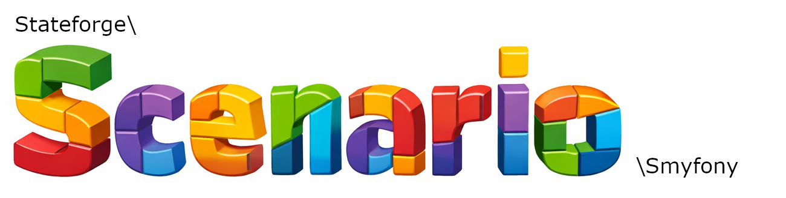

---

# Scenario Symfony
Symfony integration for Stateforge Scenario Core.

This package provides framework-specific integration for Symfony applications,
enabling seamless scenario execution within PHPUnit tests and console workflows.

It builds on top of ``stateforge/scenario-core`` and integrates with the Symfony runtime
and Doctrine ORM.

## Requirements
Scenario Symfony requires the following:

* PHP >= 8.2.
* Symfony 6.4+ or 7+
* [stateforge/scenario-core](https://github.com/laloona/scenario-core)

## Installation

> This package is intended for test and development use only.

```php
composer require --dev stateforge/scenario-symfony
```

After installation, run the setup command:
```php
php bin/console scenario:install
```

The installation command generates the required configuration files:
- creates the ``scenario.yaml`` package configuration
- enables the symfony console scenario commands
- generates the ``scenario.dist.xml``for configuration
- places the extendsion into ``phpunit.dist.xml`` or ``phpunit.xml``

## What This Package Provides
Scenario Symfony integrates Scenario Core with:
- Symfony’s service container
- Doctrine ORM (for database reset handling)
- Symfony Console
- Symfony test kernel lifecycle

## Enabling the Bundle
Register the bundle in your Symfony application:
```php
// config/bundles.php

return [
    Stateforge\Scenario\Symfony\ScenarioSymfonyBundle::class => ['dev' => true, 'test' => true],
];

```

The bundle automatically:
- registers attribute handlers
- wires scenario services
- configures database reset handling
- integrates with PHPUnit extension

## Database Reset (Doctrine Integration)
When using ``#[RefreshDatabase]``, the Symfony integration resets the database using Doctrine.

The default behavior:
- recreate the database
- executed all migrations

## Applying Scenarios in Unit Tests
Scenarios can be applied declaratively using the ```#[ApplyScenario]``` attribute:

```php
use Stateforge\Scenario\Core\Attribute\ApplyScenario;

#[ApplyScenario('my-scenario')]
final class MyTest extends TestCase
{
    #[ApplyScenario('my-second-scenario')]
    public function testSomethingImportant(): void
    {
        // scenario has already been applied, data can be tested
    }
}
```

## Console Commands
Scenario Symfony registers dedicated console commands within your Symfony application.

You can discover them using:
```bash
php bin/console list scenario
```

## Next Steps

- [Getting Started](docs/getting-started.md)
- [Configuration](docs/configuration.md)
- [Scenarios](docs/scenarios.md)
- [Parameter Types](docs/parameter-types.md)
- [CLI Usage](docs/cli.md)
- [Testing with PHPUnit](docs/testing-with-phpunit.md)
- [Recipes](docs/recipes.md)
